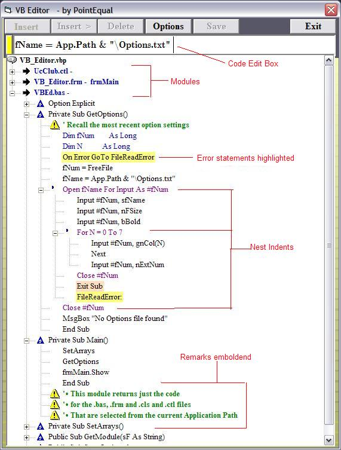

## VB6 Code View/Edit

### Description

It enables the loading of One, several or ALL code modules (.frm .bas .ctl .cls) into a treeview where you can expand or collapes modules, procedures and blocks of code - like explorer does but VB6 does not do. Code can be edited inserted or deleted. It provides a avariety of colours fonts sizes etx.
 
### More Info
 
It enables the loading of One, Several or ALL of your Application modules into a treeview so that you can expand or collapse Modules, Procedures and blocks of code - the way that Explorer works but the VB6 editor does not. It facilitates the selection of colours for various types of code lines, FontNames, Font Sizes, etc.

Of course it allows you to edit lines of code, Insert lines of code and delete lines of code - including whole Procedures. Plus it can be used without loading your App or when your App is loaded running or not running. It will optionally sort your procedures alphabetically or just show them in the sequence that they are in your existing module. This makes it easier to locate a procedure within several modules. Every time you Save your work, the original file is renamed to include a 4 digit number. Thus you will have the previous versions in your app folder. You can delete these if you satisfied that new file is 'good', or you can retain them for checking back on previous code. NOTE the changes made are to the file on disk and not to the module that is loaded. To see your changes, to have to load the file.

A treeview of modules and procedures and bocks of code

none thatI Know of

             |
---                |---
**Submitted On**   |2006-10-30 06:30:02
**By**             |[Reg](https://github.com/Planet-Source-Code/PSCIndex/blob/master/ByAuthor/reg.md)
**Level**          |Intermediate
**User Rating**    |5.0 (25 globes from 5 users)
**Compatibility**  |VB 5\.0, VB 6\.0
**Category**       |[Complete Applications](https://github.com/Planet-Source-Code/PSCIndex/blob/master/ByCategory/complete-applications__1-27.md)
**World**          |[Visual Basic](https://github.com/Planet-Source-Code/PSCIndex/blob/master/ByWorld/visual-basic.md)
**Archive File**   |[VB6\_Viewer20275910292006\.zip](https://github.com/Planet-Source-Code/reg-vb6-code-view-edit__1-66921/archive/master.zip)

